<!--
  Profile README — Vruxak21/Vruxak21
  All content is dark-terminal SVG — no Markdown sections that clash with the page theme.
  Contribution heatmap refreshed daily by .github/workflows/update-profile-art.yml.
-->

<table border="1" cellpadding="12" cellspacing="0" width="860">

<!-- ═══ Row 1: Header card ═══════════════════════════════════════════════ -->
<tr><td align="center">

</td></tr>

<!-- ═══ Row 2: Badges ════════════════════════════════════════════════════ -->
<tr><td align="center">

</td></tr>

<!-- ═══ Row 3: ASCII portrait + neofetch info card ═══════════════════════ -->
<tr><td align="center">
<table border="0" cellpadding="0" cellspacing="0"><tr>
<td></td>
<td></td>
</tr></table>
</td></tr>

<!-- ═══ Row 4: Projects card ═════════════════════════════════════════════ -->
<tr><td align="center">

</td></tr>

<!-- ═══ Row 5: Achievements + Work Experience card ════════════════════════ -->
<tr><td align="center">

</td></tr>

<!-- ═══ Row 6: Contribution heatmap (auto-refreshed daily) ═══════════════ -->
<tr><td align="center">

</td></tr>

</table>

