<!--
  Profile README — Vruxak21/Vruxak21
  All content is dark-terminal SVG — no Markdown sections that clash with the page theme.
  Contribution heatmap refreshed daily by .github/workflows/update-profile-art.yml.
-->

<!-- ═══ Row 1: Header + Badges ═════════════════════════════════════════════ -->

 

<!-- ═══ Row 2: ASCII portrait + neofetch info card ═══════════════════════ -->
<table width="860" border="0" cellpadding="0" cellspacing="0"><tr>
<td width="430"></td>
<td width="430"></td>
</tr></table>

<!-- ═══ Row 3: Projects card ═══════════════════════════════════════════════ -->

 

<!-- ═══ Row 4: Achievements + Work Experience (side by side) ══════════════ -->
<table width="860" border="0" cellpadding="0" cellspacing="0"><tr>
<td width="430" valign="top"></td>
<td width="430" valign="top"></td>
</tr></table>

 

<!-- ═══ Row 5: Contribution heatmap (auto-refreshed daily) ═══════════════ -->

