<!--
  Profile README for Vruxak21 — rendered on github.com/Vruxak21
  Portrait (avi-ascii.svg): canvas 840×875 → displayed at width 370
  Info card (info-card.svg): canvas 480×400 → displayed at width 490
  Both widths chosen so the displayed heights are approximately equal (~384px each).
-->

<table>
<tr>
<td valign="top"></td>
<td valign="top"></td>
</tr>
</table>

## Vruxak Patel

**Believe in Yourself**

 

<!-- animated contribution graph, refreshed daily by the workflow -->

